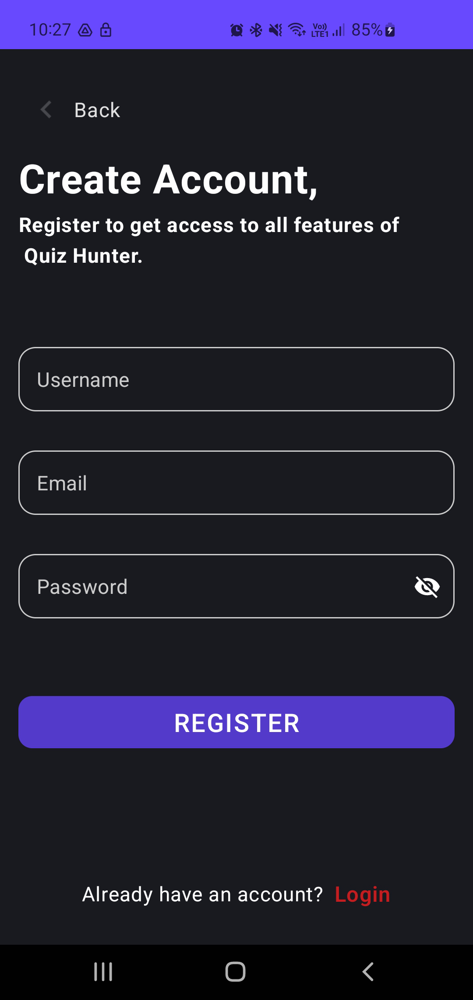

Question app
=================================

Question app what will help to learn new topic with answering on question and choosing/filtering already positive(mostly) answered questions, based on time or popularity.
    Next step implement theory for questions in case of explanation needed. Plan of taking text block of theory and linking to questions with help of AI text recognition tool.
This code demonstrates the Android Architecture pattern MVVM and component like - ViewModel and StateFlow.

Created database from .pdf of Hunter questions and implemented them with JSON objects with.addCallback() as in database builder .readFromFile() did`t work with .db or json.
Added - read data now(Tests) from Firebase Firestore.


Getting Started - 
---------------
1.If you download or clone this repo, in order to make it work, you should follow the instructions given in the official documentation regarding on [how to add Firebase to your project](https://firebase.google.com/docs/android/setup).
You can contact me directly via [Linkedin](https://www.linkedin.com/in/edgars-sin%C4%81ts-ba5864164/) to get google-services.json file to make it work straight away.

2. On load screen choose which topic questions you want to take. You will have options to choose filter out answered questions and correctly answered.


### Current app demo can be found  [Youtube](https://youtu.be/vQE1SkwBLQ4)
## 📸 Screenshots

||||
|:----------------------------------------:|:-----------------------------------------:
|
| |  |
|||
| |     |
|  |     | 
|       |   |
|   |      |
|  |  |


Currently implemented quiz with questions and option to choose count of questions as well topics and other options based on already answered previous question.
->After each test has been answered, answer are updated in local room db.
->When choosing questions you can filter out answered(correctly) questions, so you do not repeat with the same questions.
```_quiz_test``` folder under```feature_pickTest/presentation``` represent only feature.

- __quiz_test__: This is responsible for taken test.
- - __pick_test__: This is responsible for choosing test.
- __feature_auth__: This is responsible for Auth and User 
- - __ 


## Built With 🛠
 * [Firebase Authentication](https://firebase.google.com/docs/auth)
* [Cloud Firestore](https://firebase.google.com/docs/firestore)
* * [Android Jetpack Navigation](https://developer.android.com/guide/navigation)
- [Kotlin](https://kotlinlang.org/) - First class and official programming language for Android development.
- [Coroutines](https://kotlinlang.org/docs/reference/coroutines-overview.html) - For asynchronous and more..
- [Flow](https://kotlin.github.io/kotlinx.coroutines/kotlinx-coroutines-core/kotlinx.coroutines.flow/-flow/) - A cold asynchronous data stream that sequentially emits values and completes normally or with an exception.
- [StateFlow](https://developer.android.com/kotlin/flow/stateflow-and-sharedflow) - StateFlow is a state-holder observable flow that emits the current and new state updates to its collectors.
- [Compose](https://developer.android.com/jetpack/compose)
- [Android Architecture Components](https://developer.android.com/topic/libraries/architecture) - Collection of libraries that help you design robust, testable, and maintainable apps.
    - [ViewModel](https://developer.android.com/topic/libraries/architecture/viewmodel) - Stores UI-related data that isn't destroyed on UI changes.
- [Dependency Injection](https://developer.android.com/training/dependency-injection) -
    - [Hilt-Dagger](https://dagger.dev/hilt/) - Standard library to incorporate Dagger dependency injection into an Android application.
    - [Hilt-ViewModel](https://developer.android.com/training/dependency-injection/hilt-jetpack) - DI for injecting `ViewModel`.
- Backend
    ```_TODO```  - [Firebase](https://firebase.google.com) 
        - Firebase Auth - To support email based authentication and google authentication
    - [Room](https://harperdb.io) -  HarperDB is a geo-distributed database with hybrid SQL & NoSQL functionality in one powerful tool, accessed via a REST API.
- [GSON](https://github.com/square/moshi) - A modern JSON library for Kotlin and Java.
- [Moshi Converter](https://github.com/square/retrofit/tree/master/retrofit-converters/gson) - A Converter which uses Moshi for serialization to and from JSON.
- [Material Components for Android](https://github.com/material-components/material-components-android) - Modular and customizable Material Design UI components for Android.
- [Truth](https://github.com/google/truth) - Truth is a library for performing assertions in tests:

MVVM Architecture: 


